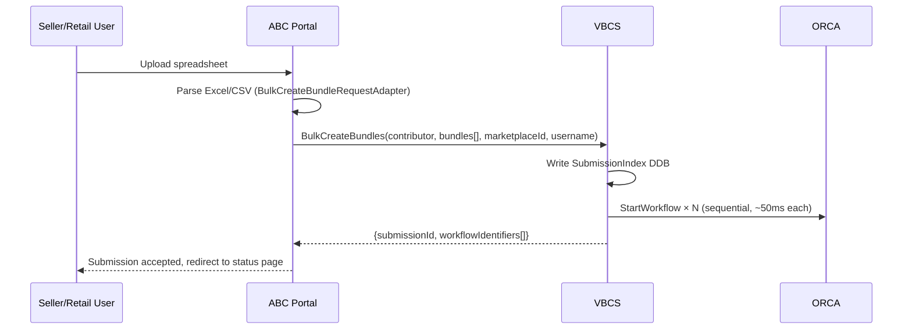
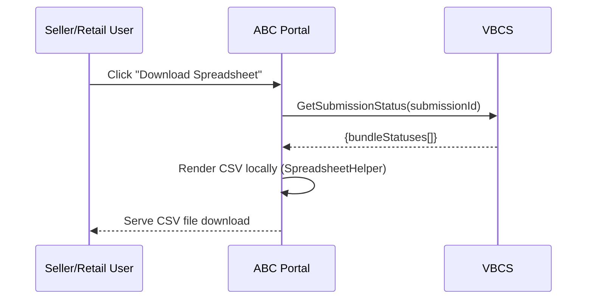
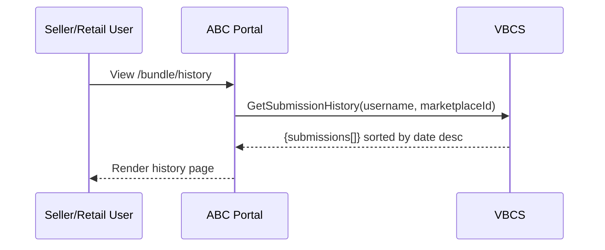
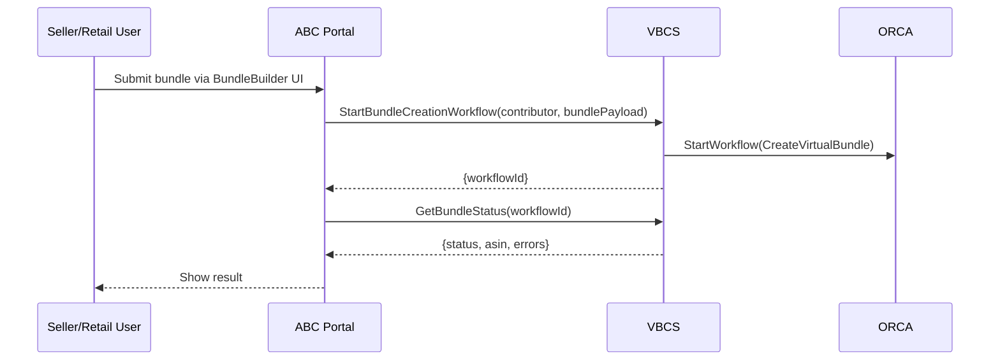
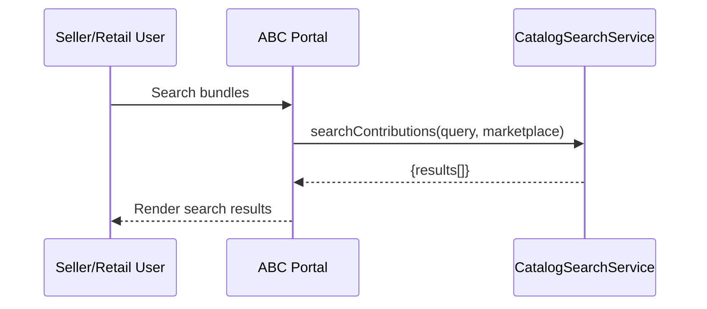

# TASK-096: ABC Migration Design — Separate Design Review

## Objective
Create a dedicated design document for the ABC→VBCS migration covering bulk creation, status APIs, content generation, image collage, historical data migration, weblab cutover strategy, and error format compatibility. This will go through its own design review.

## Context
The v3 PBXX→VBCS migration design was cut down to focus on Phase 0 foundation and MBRS migration. ABC migration detail (previously ~200 lines across multiple sections) was moved here to keep the main design reviewable. ABC is the heaviest client (7 PBMS ops, 4 PBCW ops, 1 PBCS op) and needs its own design review.

## Preserved Context from v3 Design

### Bulk Bundle Creation

ABC uploads spreadsheets to PBMS for bulk bundle creation. VBCS has no bulk API.

ABC's `BulkCreateBundleRequestAdapter` (75KB) parses Excel/CSV client-side and builds structured protobufs before calling PBMS. However, PBMS also exposes spreadsheet-related APIs that ABC calls:
- `bulkCreateProductBundles` — accepts the parsed protobuf payload (not raw spreadsheet bytes). ABC parses the spreadsheet locally, then sends structured data.
- `getBulkCreateBundleStatusSpreadsheet` — generates a status spreadsheet (Excel) for download. This is a *status reporting* API, not a parsing API.

**ABC → VBCS: Bulk creation flow**



**Handling 500 concurrent workflows:** `BulkCreateBundles` will start ORCA workflows sequentially within the API call before returning. At ~50ms per `StartWorkflow` call, 500 bundles takes ~25 seconds — within Coral's default timeout. Start with sequential and optimize if needed.

**ABC → VBCS: Status spreadsheet download**



`GenerateStatusSpreadsheet` stays in ABC, not VBCS. ABC will call `GetSubmissionStatus` to get structured data and generate the CSV locally (it already has Apache POI/CSV dependencies and `SpreadsheetHelper.java`). This eliminates the S3 bucket entirely.

See `appendix-api-specifications.md` for the `BulkCreateBundles` contract:
```
BulkCreateBundles(contributor, bundles[], marketplaceId, submitterUsername) → {submissionId, workflowIdentifiers[]}
```

#### Bulk Submission Status Tracking

VBCS will implement with a lightweight DynamoDB submission index — on `BulkCreateBundles`, write a single record mapping `submissionId → [workflowId1, workflowId2, ...]`.

`GetSubmissionStatus(submissionId)` will read the SubmissionIndex, then fan out to WorkflowState DDB for each workflow ID.

**How WorkflowState gets updated throughout the lifecycle:**
1. **At workflow start** — VBCS writes a PENDING record.
2. **On key milestones** — Status updated as workflow progresses.
3. **On completion/error** — SNS subscriber writes final status.

**Gap: timed-out or ORCA-killed workflows.** `WorkflowErroredEvent` sink exists but is NOT referenced in any workflow graph's `<lifecycle-events>`. Must add to all 4 graphs (Phase 0 blocker).

#### Submission History

ABC's history page (`/bundle/history/{username}`) queries all past submissions for a given user. VBCS will replicate via `submitterUsername` GSI on SubmissionIndex table.



### ABC Single Bundle Create/Edit



### ABC Bundle Search (not VBCS)



### Content Generation

PBGCS (`ProductBundleGenerateContentService`, 22 Java files) is a Coral service that generates bundle content using LLM via Jazz Service. The flow:

1. `GenerateContentActivity.getBundleContent()` receives component ASINs + marketplace + per-attribute boolean flags
2. `DatapathManager.retrieveComponentDetails()` fetches component titles, descriptions, and bullet points from Datapath
3. `JazzManager.generateBundleDetails()` calls Jazz Service with 4 prompt templates (title, short title, description, bullets)
4. All 4 Jazz calls are made async and collected with 40s timeout
5. `DynamoDbManager.saveCreationRequestForTracking()` persists the request + generated content

Implementation: VBCS will accept per-attribute generation flags: `generateTitle`, `generateShortTitle`, `generateDescription`, `generateBulletPoints` (all boolean, default false). A new `ContentGenerationActivity` in the `CreateVirtualBundle` workflow will check if any flag is true — if so, it calls PBGCS; if all are false, the activity is skipped entirely. Content generation is opt-in per attribute.

**Deprecation note:** PBGCS depends on Jazz Service (being deprecated). Replacement: `BundleContentGenerationService` (EU away team). VBCS will integrate with PBGCS as temporary bridge, then swap.

### Image Collage Detail

PBCW calls AAPI → physicalIds → `_CLa` collage URLs. VBCS calls Datapath → same physicalIds → same URLs. No AAPI onboarding needed.

Evidence:
- PBCW: `AmazonApiService.getImagesFromAAPI()` → `ProductImagesV2` → physicalId → `ImageCollageService.buildCollageUrl()`
- VBCS: `DatapathGatewayAccessor.getProductImages()` → `rankedmedia::rankedImagesV2` → physicalId → `ImageCollageProvider`

**Multipack gap (REQ-008a):** PBCW's `buildCollageUrlSingleAsin()` repeats physicalId N times based on quantity (capped at 5). VBCS's `ImageCollageProvider` needs the same logic. Code change only.

*Source: `ImageCollageService.java` line 258: `IntStream.range(1, baseAsinQuantity).forEach(i -> buildOtherComponentsCollageUrl(collageUrl, physicalId))`*

### Historical Data Migration

PBMS tables have no TTL — clients see full submission history. Decision: migrate meaningful data.

**What to migrate (plain DDB attributes, no protobuf):**
- `ProductBundleTrackingTable` → SubmissionIndex (submission metadata)
- `BundleStatusTable` → WorkflowState (per-bundle status)

**What we skip:** `BulkBundleCreationStatusTable` (protobuf blobs for spreadsheet generation — no longer needed).

**Migration approach options:**

1. **One-time DDB migration:** DDB scan + batch write, maintenance window, validate record counts, grace period.

2. **PBXX fallback with lazy migration (preferred simplicity):** Once VBCS has history/status tracking working, add a fallback — if the data isn't in VBCS's database, VBCS calls PBXX for the history/status. This makes migration trivial: once 100% of traffic routes through VBCS, all new data lands in VBCS tables. Then do a one-time data transfer of historical records to VBCS DDB, after which VBCS stops calling PBXX. No maintenance window, no big-bang cutover — the fallback handles the transition gracefully.

### Error Format Compatibility

During implementation, verify that VBCS's `BundleError` format (`{code, message, field}`) is compatible with ABC's frontend error parser — if PBMS error codes differ from VBCS error codes, ABC's error rendering will be updated as part of the migration.

### Phase 4 Client Analysis (external clients)

| Client | Package | PBXX APIs Used | VBCS APIs Needed | Effort |
|---|---|---|---|---|
| **Limestone** | `ReSESProductBundleCatalogServiceIntegrationLambdas` (21 files, 3 Lambdas) | PBCS: `activateBundle`, `suppressBundleOffer`, `editBundle` | `ActivateBundle`, `SuppressBundleOffer`, `StartBundleEditWorkflow` | Low |
| **BUDA** | `BUDADeviceBundleManagerService` (90 files) | PBMS: `bulkCreateProductBundles`, `getBulkCreateBundleStatus` | `BulkCreateBundles`, `GetSubmissionStatus` | Low-Medium |
| **PACMAN** | `S2XPACManABCComponentLambda` (13 Kotlin files) | PBMS: 2 ops | `BulkCreateBundles`, `GetSubmissionStatus` | Their workstream |

Key findings: Limestone calls PBCS directly. BUDA calls PBMS only. PACMAN already actively migrating. We can draft CRs for external teams showing client-side changes needed.

### Alternatives Considered

**Parent ORCA Workflow for Bulk Submissions (rejected):** ORCA doesn't natively support parent-child workflows. Would need custom orchestration logic reimplementing what DDB + fan-out gives for free. Long-running parent workflow consuming ORCA capacity. DynamoDB SubmissionIndex chosen instead.

**Server-Side Spreadsheet Parsing in VBCS (rejected):** ABC already has a mature 75KB parser. Spreadsheet format is a UI concern. Other clients don't use spreadsheets. VBCS accepts structured payloads only.

**Historical Data — No Migration (rejected):** Clients lose all history on cutover. Poor UX. **Full Migration Including Protobuf (rejected):** Requires protobuf deserialization, error-prone, only used for spreadsheet generation which is moving to ABC.

### Proposed Tasks

- ABC calls CatalogSearchService directly (TASK-052, blocked on design)
- ABC GenerateStatusSpreadsheet — local CSV from `GetSubmissionStatus`
- ABC weblab for VBCS cutover
- ABC MCM dial-up
- ABC dashboard + metrics for new APIs
- Historical data migration script — one-time DDB scan
- Content generation: ContentGenerationActivity (ORCA), PBGCS dependency onboarding, per-attribute generation flags
- Image collage multipack fix in `ImageCollageProvider`

## Acceptance Criteria
- [ ] Design document covering ABC→VBCS migration
- [ ] Design review scheduled and completed
- [ ] Implementation tasks created from design

## Notes
---
2026-03-06 21:45 - Created. Content preserved from v3 design sections: Bulk Bundle Creation, Content Generation, Image Collage, How Clients Migrate (ABC detail), Historical Data Migration, Phase 4 Client Analysis, and appendix-alternatives-considered.md (all 3 sections).
2026-03-07 15:36 - Added migration option 2: PBXX fallback approach. If data isn't in VBCS DB, fall back to PBXX for history/status. Once 100% traffic migrated, do one-time data transfer and stop calling PBXX. Simpler than big-bang DDB migration.
2026-03-07 19:45 - Protocol note moved here from main design: PBXX services use protobuf-over-HTTP (not Coral RPC). VBCS uses Coral. Clients migrating from PBXX to VBCS will need a protocol change — replacing protobuf HTTP clients with Coral RPC clients. This applies to ABC, Limestone, BUDA, and any other direct PBXX callers.
